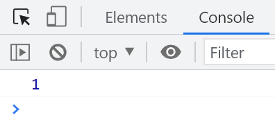

# JSONP 跨域请求 JSON 数据

JSONP（JSON with Padding）是一种跨域获取 JSON 数据的非官方使用模式。它利用了某些 HTML 标签不受同源策略限制的特性，比如`script`标签可以引入不同源的 JavaScript 文件。

需要注意的是：
JSONP 抓取的资源并不是直接的 JSON 数据，而是一个带有 JSON 数据作为参数的函数调用。

## 客户端期望返回的 JSON 格式

```json
{ "name": "Jacky", "age": "18" }
```

## JSONP 实际返回的格式

```javascript
callback({ name: 'Jacky', age: '18' });
```

JSONP 利用了以下几种标签不受同源策略影响的特性：

1. `img`标签的`src`属性可以引入不同源的图片资源
2. `link`标签的`href`属性可以引入不同源的 CSS 文件
3. `iframe`标签的`src`属性可以引入不同源的网页
4. `script`标签的`src`属性可以引入不同源的 JavaScript 文件

## 浏览器如何解析 script 标签引入的资源

当使用`script`标签引入一个资源时，浏览器会将其作为 JavaScript 代码来执行。

例如有以下 HTML 代码：

```html
<script src="./data.js"></script>
<script>
  console.log(username);
</script>
```

假设`data.js`文件的内容如下：

```javascript
var username = 'Jacky';
```

执行结果：


可以看到，`script`标签成功引入并执行了`data.js`中的代码，因此第二个`script`标签中可以访问到`username`变量。

## 使用 jQuery 发送 JSONP 请求

```javascript
$.ajax({
  type: 'get',
  url: 'http://www.example.com/data',
  dataType: 'jsonp',
  jsonp: 'callback',
  success: function (response) {
    console.log(response);
  },
});
```

其中的一些参数说明如下：

- `dataType: "jsonp"`表示使用 JSONP 方式请求
- `jsonp: 'callback'`指定回调函数名的参数名，默认为`callback`
- 如果不指定`jsonpCallback`，返回的数据会传入`success`回调函数
- 如果指定了`jsonpCallback: 'handleResponse'`，则返回的数据会传入名为`handleResponse`的全局函数

## 跨域请求的完整示例

在下面的仓库中有一个使用 JSONP 跨域请求百度搜索建议数据的完整示例：
[https://github.com/sumingcheng/JavaScript-practise/tree/main/AJAX/baidu_search](https://github.com/sumingcheng/JavaScript-practise/tree/main/AJAX/baidu_search)
