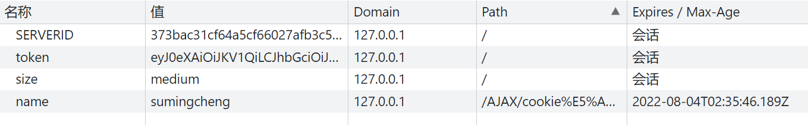
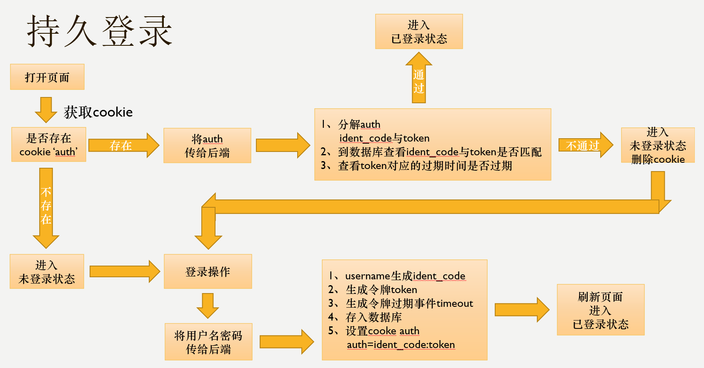
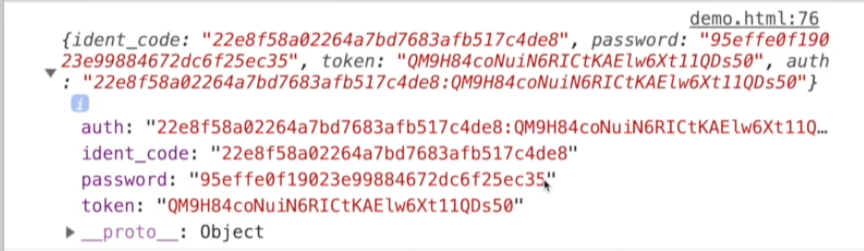

# Cookie 增删改查与用户追踪

## 用户追踪的常见方式

1. HTTP headers
2. IP 地址
   某些 IPS 可能会分配动态 IP,因此并不总是可靠
3. 用户登录时生成唯一标识
4. 胖 URL
   通过生成特定版本的 URL 来追踪用户,但会增大服务器缓存压力
5. Cookie
   由服务器发送给用户浏览器并保存在本地的一小块数据



## 创建 Cookie

可以通过设置`document.cookie`来创建 Cookie:

```javascript
// 设置名字和过期时间,如果设置为过去的时间则立即删除
document.cookie = 'name=sumingcheng;max-age=3600';
```

注意过期时间使用的是世界协调时(UTC)。

## 设置 Cookie 过期时间

除了`max-age`,还可以使用`expires`属性设置 Cookie 的过期时间:

```javascript
var d = new Date();
var day = d.getDate();
// 十天后过期
d.setDate(day + 10);
document.cookie = 'name=sumingcheng;expires=' + d;
```

## 相同名称的 Cookie

在相同域名下,同名的 Cookie 键只能设置一个值,后设置的会覆盖之前的:

```javascript
document.cookie = 'name=sumingcheng';
document.cookie = 'name=niub'; // 会覆盖前一个值
```

## 删除 Cookie

将 Cookie 设置为一个已经过去的时间,就会被自动删除:

```javascript
document.cookie = 'name=sumingcheng;expires=Thu, 01 Jan 1970 00:00:00 GMT';
```

## 封装 Cookie 操作

为了方便管理 Cookie,我们可以将常用的操作封装成一个对象:

```javascript
var manageCookies = {
  set: function (key, value, expTime) {
    document.cookie = `${key}=${value};max-age=${expTime};`;
    return this;
  },
  delete: function (key) {
    return this.set(key, '', -1);
  },
  get: function (key) {
    var cookieArray = document.cookie.split(';');
    for (let i = 0; i < cookieArray.length; i++) {
      var cookieItem = cookieArray[i];
      var [k, v] = cookieItem.split('=');
      if (k.trim() === key) {
        return v;
      }
    }
    return undefined;
  },
};

manageCookies.set('name', 'sumingcheng', 1000).set('age', '20', 1000).set('hobby', 'basketball', 1000).set('sex', 'male').delete('name');

console.log(manageCookies.get('hobby')); // basketball
```

这里使用了链式调用,set 方法会返回 manageCookies 对象本身,方便连续设置多个 Cookie。
get 方法先将 document.cookie 按;分割成数组,然后遍历查找指定的 key,找到就返回对应的值,没找到返回 undefined。

## 持久登录



持久登录的基本原理是:

1. 用户在客户端输入账号密码登录
2. 服务端验证通过后,生成包含用户信息的 token
3. 将 token 以 Cookie 的形式种到客户端
4. 后续请求时,客户端带上该 Cookie
5. 服务端验证 Cookie 中的 token,确认用户身份

这样在 token 的有效期内,用户就无需重复登录了。

## 单点登录(SSO)

单点登录允许用户在多个不同源的站点登录一次后,就能保持登录状态,无需重复登录。实现 SSO 的一种方案是:

1. 约定一个密钥 salt,如 salt='yan',用于加密用户信息
2. 将 username 通过 md5(md5(username) + salt)转换为 ident_code 作为用户的身份标识
3. 将 password 通过 md5(md5(password) + salt)加密
4. 每次登录生成新的 token 作为身份令牌
5. 将 ident_code 和 token 拼接为 auth,存入 Cookie



用户在其他站点访问时,会带上 auth Cookie,SSO 服务器验证其中的 ident_code 和 token,确认是已登录用户,并返回相应的用户信息。
