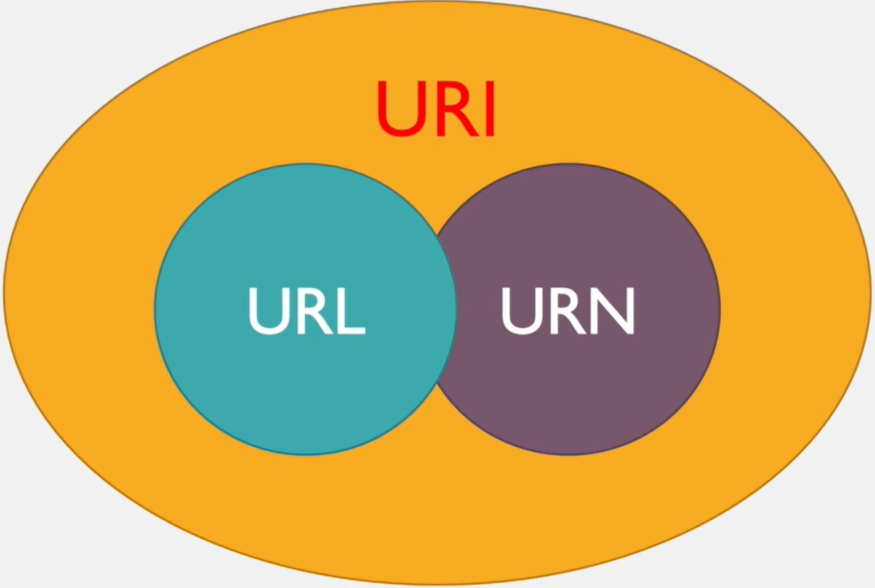
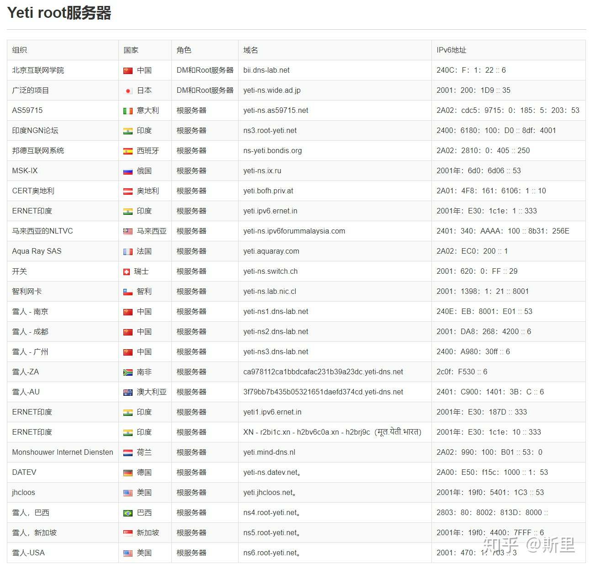

# 浏览器请求一个网页的流程

## 客户端

客户端通常指浏览器这类应用程序。根据架构的不同，客户端可以分为 C/S 架构和 B/S 架构。本节将客户端理解为浏览器。

## 服务端

服务端是数据文件的入口或出口，负责数据的管理和程序的运行。服务器通常指的是几 U 的机架式服务器，比较大型的服务器，安装 Linux 系统或其他服务器专用的操作系统。

## 简单流程

当客户端在浏览器中输入域名时，DNS 服务器将其解析为 IP 地址。随后，客户端与服务器建立 TCP/IP 三次握手，建立 TCP 连接并发起 HTTP 协议请求。服务器首先传输 HTML，浏览器解析这些 HTML，继续下载 HTML 中的静态资源，包括图片，然后渲染页面。最后，进行四次挥手终止连接请求。

# URL、URN、URI

## URI

统一资源标识符用于标识一个资源。

## URL

统一资源定位符不仅用于标识一个资源，还指明了如何定位该资源。URL 通过地址定义一个资源。

## URN

统一资源命名通过名称来标识资源，用名称定位一个资源。

# 三者之间的关系



## URI

资源的标识的总称。

## URL

URL 不仅是资源的标识，还具备定位资源的功能，并指明获取资源所采用的协议。

| **协议名称** | **主机名称及端口号** | **路径及文件**   | **参数**   | **其他内容** |
| ------------ | -------------------- | ---------------- | ---------- | ------------ |
| http         | jsplusplus.com:80    | index/index.html | ?a=1&b=2   | #d           |
| `<scheme>`   | `<host>:<port>/`     | `<path>`         | `?<query>` | `<frag>`     |

## URN

`jsplusplus.com:80/index/index.html?a=1&b=2#d` 表示一个资源的名称，通过该名称可以定位资源。

## 例子

寻找一个不认识的人，URL 可以比作家庭住址，而 URN 则类似于姓名和身份证号。

## 客户端与服务端

客户端包括 QQ、微信、LOL 以及网易云音乐等应用程序。服务端负责存储网页、数据库、数据处理程序等后端逻辑，并运行数据库的服务器。API 通过请求返回所需的数据，以微信小程序为例，URL 中包含的即为 API。

```javascript
wx.request({
  method: 'post',
  url: 'http://shenqing.bjhjyd.edu.cn/acs//common/validCodeImage',
  header: {
    'content-type': 'application/x-www-form-urlencoded;charset=utf-8',
  },
});
```

# C/S 与 B/S 架构

## C/S 架构

在 C/S 架构中，应用程序安装在客户端电脑中，由服务端提供客户端程序所需的数据。此架构的优点包括界面与操作丰富、安全性高、响应速度快。然而，它通常用于局域网，需要安装特定应用程序和硬件，维护成本较高。

## B/S 架构

B/S 架构利用 WEB 浏览器呈现客户端程序界面，由服务端提供所需的数据。其优点是无需安装客户端程序与特定硬件，支持多客户访问，交互性强，且无需升级客户端。但缺点包括跨浏览器兼容性差、功能相对有限、设计成本高、安全性较弱以及交互性相对较弱。

# 服务器的购买

## 以阿里云 ECS 为例

### 弹性计算服务

通过选择不同的配置，如镜像、带宽、网络类型、区域等，可以实例化出新的服务器。这一过程类似于创建新对象，通过设置构造函数中的参数来修改实例。弹性计算服务允许随时扩容，并按需进行配置购买。

## 创建快照

创建快照类似于在使用 VMware 时的快照功能。

## 块存储

块存储更适合存放结构化的数据。

### 块设备

块设备通常指以磁盘形式存在的存储设备。

块存储强调的是裸磁盘，所有以磁盘形式直接供给主机或服务器访问的存储都是块存储。

## 安全组

安全组负责监控整个云服务的运行安全。

# 域名

## 域名的好处

域名便于记忆。一个 IP 可以对应多个域名，但一个域名不能对应多个 IP。

## 域名备案

如果服务器位于中国，则需要进行备案。服务器位于国外则无需备案，但可能随时被屏蔽。目前的备案手续相对简单，大部分可以在线完成，只需提供相关背景材料的照片。

## 记录类型

### A 记录

A 记录用于将域名指向服务器的 IP 地址。

### CNAME 记录

CNAME 记录用于将多个名称映射到另一个域名。

## 域名分类

### 机构和企业

| 域名后缀      | 适用机构             |
| ------------- | -------------------- |
| .com、.com.cn | 工商金融等企业       |
| .gov、.gov.cn | 政府机构             |
| .net、.net.cn | 提供互联网服务的机构 |
| .org          | 各类组织机构         |
| .ac、.ac.cn   | 科研机构             |
| .edu、.edu.cn | 教育机构             |

### 国家和地区

| 域名后缀 | 国家/地区 |
| -------- | --------- |
| cn       | 中国      |
| ca       | 加拿大    |
| uk       | 英国      |
| jp       | 日本      |
| kr       | 韩国      |
| hk       | 香港      |
| tw       | 台湾      |

## 域名级别

| 域名级别 | 示例                    |
| -------- | ----------------------- |
| 一级域名 | baidu.com               |
| 二级域名 | wenku.baidu.com         |
| 三级域名 | wenku.english.baidu.com |

## 根域名服务器

根域名服务器负责全球互联网域名根域名服务器、域名体系和 IP 地址的管理。主根域名服务器位于美国，辅根域名服务器共有 12 个，其中美国有 9 个，英国、瑞典、日本各有一个。管理结构由国际互联网名称与数字地址分配机构 ICANN 负责，前管理机构是商务部下属的国家通信与信息管理局（NTIA），现由 ICANN 外包管理。

## 雪人计划

雪人计划旨在建设自己的主根服务器和 3 个辅根服务器。


