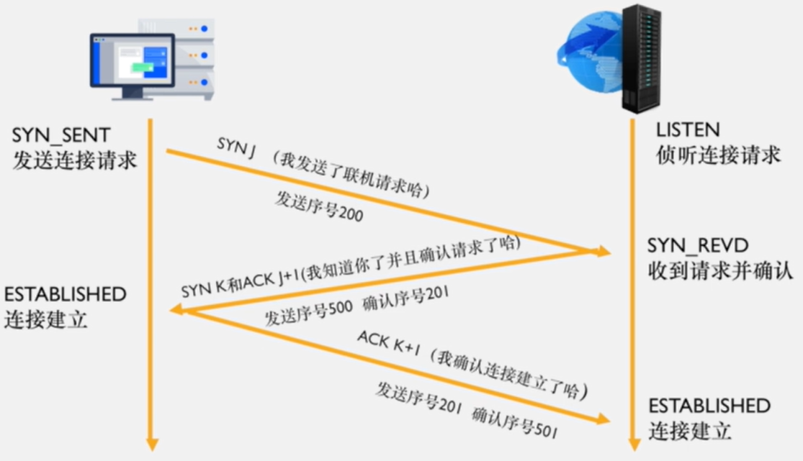

# 网络基础知识

## WWW

万维网 `World Wide Web` 是一个全球性的互联信息空间，通过互联网提供丰富的资源和服务。

## 域名级别

### 一级域名

`baidu.com` 是一个典型的一级域名，代表了一个顶级域名下的主要域名。

### 二级域名

`www.baidu.com` 是二级域名，用户通常习惯访问带有 `www` 前缀的域名，中国用户尤其喜欢解析 `www` 这一二级域名。

### 三级域名

`nsi.www.baidu.com` 是三级域名，带有更多的前缀，用于表示更细化的模块或服务。

## DNS

域名服务器 `Domain Name Server` 负责将域名解析为对应的 IP 地址。

一个域名可以对应一个 IP 地址，同时一个 IP 地址也可以对应多个域名。

### gTLD

顶级域名服务器 `Generic Top-Level DNS Server` 又称根域名服务器，负责为所有 `.com`、`.net` 等后缀的域名提供解析服务。

## DNS 解析过程

当在浏览器的地址栏输入域名 `www.nsi.com` 时，DNS 解析过程如下：

首先，操作系统会检查本地的 `hosts` 文件中是否有该域名的映射关系。如果存在，系统将直接使用该 IP 地址完成域名解析。如果不存在，系统会向本地运营商的 DNS 服务器请求该域名的 IP 地址。

运营商的 DNS 服务器会依次查询 DNS 表、根域名服务器、`.com`域名服务器、服务商（如阿里云）的域服务器，最终查找到用户购买的域服务器中的一级域名表，进而解析出二级域名的 IP 地址。

## IP

`Internet Protocol Address` 是互联网上每个设备的唯一标识。

### IPv6

IPv6 相较于 IPv4 具有以下优势：

地址空间更大，由 8 组（128 位）十六进制数表示  
路由表更小，提高路由效率  
增强了组播支持和对流支持  
支持自动配置，简化网络管理  
提供了更好的安全性

### 端口号

每个端口对应服务器的一个业务，服务器的不同端口相当于访问不同的服务。

端口号范围为 `0~65535`，常用的默认端口包括 `HTTP` 的 80 端口、`HTTPS` 的 443 端口以及 `FTP` 的 20/21 端口。

## TCP（传输控制协议）

传输控制协议 `Transmission Control Protocol` 具有以下特点：

面向连接，必须建立可靠的连接才能传输数据  
建立连接的基础是三次握手  
适用于需要确保数据准确无误传输的场景  
优点包括稳定性高、具有重传机制、支持断开连接和阻塞控制  
缺点是速度较慢、效率低、占用资源较多，且容易受到 `DOS`、`DDOS` 攻击

### TCP/IP（协议组）

TCP/IP 协议组提供点对点的连接机制，制定了数据封装、定址、传输、路由和数据接收的标准。

## UDP（用户数据报协议）

用户数据报协议 `User Datagram Protocol` 具有以下特点：

面向无连接，不可靠的协议，采用无状态传输机制  
信息发送时无需建立连接  
适用于无需确保通信质量且要求速度快的场景  
优点包括安全性高、传输速度快、漏洞较少，但可能受到 `UDP flood` 攻击  
缺点是不可靠、不稳定，容易丢包

只要目标的源地址、端口号正确，UDP 可以直接发送信息报文，但无法保证信息一定被接收或接收完整。

## HTTP/HTTPS

`Hypertext Transfer Protocol (HTTP)` 是客户端和服务端之间请求与应答的标准协议，用于从 WEB 服务器传输超文本到本地浏览器。

HTTP 协议是不安全的，传输的数据都是明文，运行在 TCP 连接上，无法验证客户端和服务端的身份。

`Hypertext Transfer Protocol Secure (HTTPS)` 是 HTTP 的安全版本，基于 `SSL/TLS` 协议，为网络通信提供数据完整性和加密。

HTTPS 协议传输的内容全部经过 `SSL/TLS` 加密，并运行在 `SSL/TLS` 之上，`SSL/TLS` 又运行在 TCP 连接上，因此数据传输更加安全。

### SSL

安全套接层 `Secure Sockets Layer` 是一种加密协议，旨在为网络通信提供安全保障。

### TLS

传输层安全 `Transport Layer Security` 是 SSL 的继任者，提供更强的加密和安全性。

## 建立 TCP 连接的前奏

### 标志位

`SYN`（synchronize sequence numbers）用于同步序列编号  
`ACK`（acknowledgement）用于确认

### 状态

`LISTEN`：监听 TCP 端口的连接请求，等待客户端发送请求  
`SYN-SENT`：发送连接请求后，等待服务器的确认  
`SYN-RECEIVED`：收到并发送连接请求后，等待客户端的确认  
`ESTABLISHED`：连接已建立，数据可以开始传输

## 三次握手

### 过程说明

客户端向服务器发送带有 `SYN` 标志位的连接请求，进入 `SYN_SEND` 状态，等待服务器确认。  
服务器收到 `SYN` 请求后，发送带有 `ACK` 和 `SYN` 标志位的响应，进入 `SYN_RECV` 状态。  
客户端收到响应后，发送带有 `ACK` 标志位的确认信息，进入 `ESTABLISHED` 状态，完成连接建立。  
服务器收到 `ACK` 后，也进入 `ESTABLISHED` 状态，连接正式建立，数据开始传输。
