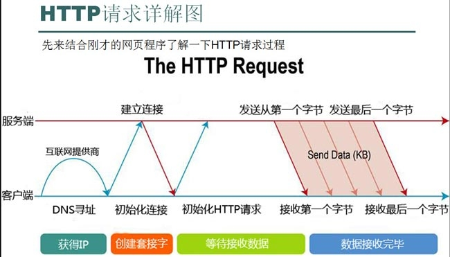
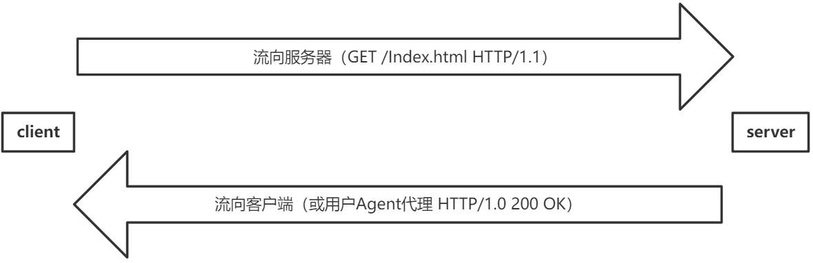
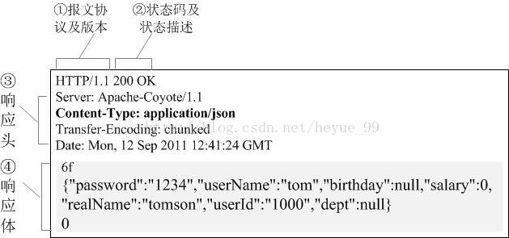
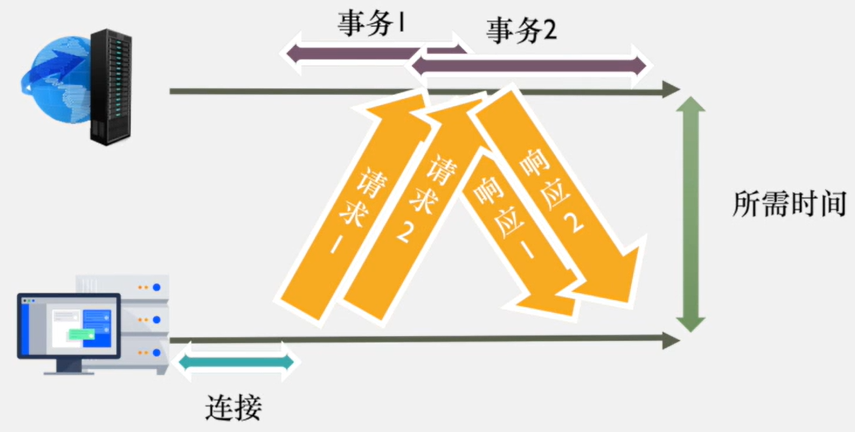

# HTTP 报文与请求方式

## 请求网页的流程

## HTTP 报文组成

HTTP 基于客户端/服务器(C/S)架构模型,通过可靠的 TCP 连接交换协议,是一个无状态的请求/响应协议。每次连接只处理一个请求,服务器处理完客户的请求并接收到客户的应答后就断开连接。这种方式可以节省传输时间。

HTTP 报文由三部分组成:

1. 起始行:描述请求或响应的基本信息
2. 头部字段:使用 key-value 形式更详细地说明报文
3. 消息正文:实际传输的数据,可以是文本,图片,视频,音频等内容

### 请求报文

请求报文由请求行、请求头部、空行和请求数据 4 个部分组成。

### 响应报文

响应报文由状态行、消息报头、空行和响应正文 4 个部分组成。

## HTTP 请求方法

HTTP1.0 定义了三种请求方法:GET、POST 和 HEAD 方法。

HTTP1.1 新增了五种请求方法:OPTIONS、PUT、DELETE、TRACE 和 CONNECT 方法。

| 序号 | 方法    | 描述                                                                                                                                   |
| ---- | ------- | -------------------------------------------------------------------------------------------------------------------------------------- |
| 1    | GET     | 请求指定的页面信息,并返回实体主体。                                                                                                    |
| 2    | HEAD    | 类似于 get 请求,只不过返回的响应中没有具体的内容,用于获取报头                                                                          |
| 3    | POST    | 向指定资源提交数据进行处理请求(例如提交表单或者上传文件)。数据被包含在请求体中。POST 请求可能会导致新的资源的建立和/或已有资源的修改。 |
| 4    | PUT     | 从客户端向服务器传送的数据取代指定的文档的内容。                                                                                       |
| 5    | DELETE  | 请求服务器删除指定的页面。                                                                                                             |
| 6    | CONNECT | HTTP/1.1 协议中预留给能够将连接改为管道方式的代理服务器。                                                                              |
| 7    | OPTIONS | 允许客户端查看服务器的性能。                                                                                                           |
| 8    | TRACE   | 回显服务器收到的请求,主要用于测试或诊断。                                                                                              |
| 9    | PATCH   | 是对 PUT 方法的补充,用来对已知资源进行局部更新 。                                                                                      |

## GET 和 POST 请求的区别

GET 和 POST 是 HTTP 请求的两种基本方法,要说它们的区别,大致有以下几点:

1. GET 请求参数通过 URL 传递,POST 放在 Request body 中。

2. GET 请求在 URL 中传送的参数是有长度限制的,而 POST 没有。

3. GET 比 POST 更不安全,因为参数直接暴露在 URL 上,所以不能用来传递敏感信息。

4. GET 请求只能进行 url 编码,而 POST 支持多种编码方式。

5. GET 请求的参数数据会被完整保留在浏览器历史记录里,而 POST 中的参数不会被保留。

6. 对参数的数据类型,GET 只接受 ASCII 字符,而 POST 没有限制。

7. GET 产生一个 TCP 数据包,POST 产生两个 TCP 数据包。(非必然,详情请点击)

8. GET 请求会被浏览器主动 cache,而 POST 不会,除非手动设置。

9. GET 请求只能进行 url 编码,而 POST 支持多种编码方式。

10. GET 请求参数会被完整保留在浏览器历史记录里,而 POST 中的参数不会被保留。

11. 对参数的数据类型,GET 只接受 ASCII 字符,而 POST 没有限制。

12. GET 和 POST 本质上就是 TCP 链接,并无差别。但是由于 HTTP 的规定和浏览器/服务器的限制,导致他们在应用过程中体现出一些不同。

## POST 请求过程

1. 浏览器发送 TCP 连接请求到服务器,服务器和浏览器建立 TCP 三次握手。

2. 握手成功后,浏览器向服务器发送 HTTP POST 请求,请求头中包含了要访问的 URL 地址、HTTP 版本号、请求方法等信息。

3. 服务器接收到请求后,会对请求头进行检查,如果请求头有问题,就会返回相应的错误信息。如果没问题,服务器会返回 100 Continue 响应,表示客户端可以继续发送请求体。

4. 浏览器收到 100 Continue 响应后,开始发送请求体。请求体可以包含文本、图片、视频等内容。

5. 服务器收到请求体后,会对请求体进行处理。如果处理成功,就返回 200 OK 响应,并在响应头中包含了处理结果的信息。

6. 浏览器收到响应后,会根据响应头中的信息来显示响应内容,比如将服务器返回的 HTML 文本解析并渲染出来。

## GET 请求过程

1. 浏览器发送 TCP 连接请求到服务器,服务器和浏览器建立 TCP 三次握手。

2. 握手成功后,浏览器向服务器发送 HTTP GET 请求,请求头中包含了要访问的 URL 地址、HTTP 版本号、请求方法等信息。

3. 服务器接收到请求后,会对请求头进行检查,如果请求头有问题,就会返回相应的错误信息。如果没问题,服务器会在响应头中返回 200 OK,表示请求成功。同时,响应头中还会包含请求的 URL 地址、HTTP 版本号、内容类型、内容长度等信息。

4. 浏览器收到响应后,会根据响应头中的信息来显示响应内容,比如将服务器返回的 HTML 文本解析并渲染出来。

## 持久连接

HTTP 协议采用"请求-应答"模式,当使用普通模式,即非 Keep-Alive 模式时,每个请求/应答客户和服务器都要新建一个连接,完成之后立即断开连接(HTTP 协议为无连接的协议)。

当使用 Keep-Alive 模式(又称持久连接、连接重用)时,Keep-Alive 功能使客户端到服务器端的连接持续有效,当出现对服务器的后继请求时,Keep-Alive 功能避免了建立或者重新建立连接。

### 管道化持久连接

HTTP/1.1 还允许客户端不用等待上一次请求结果返回,就可以发出下一次请求,但服务器端必须按照接收到客户端请求的先后顺序依次回送响应结果,以保证客户端能够区分出每次请求的响应内容,这样也显著地减少了整个下载过程所需要的时间。

## 幂等性

幂等性是 HTTP 协议提供的一种保证,使得多次请求的效果与一次请求的效果相同。

### 数学中的幂等

在数学中,幂等是指 N 次变换与 1 次变换的结果相同。

### HTTP 中的幂等性

在 HTTP 中,幂等性是指多次执行同一个请求,结果也都一样,不会因为多次请求而产生副作用。

1. GET 请求就是一个典型的幂等请求。无论你对一个 URL 地址执行多少次 GET 请求,结果都是一样的。

2. POST 请求不是幂等的。比如,我们多次发送一个 POST 请求,就会创建多个资源。

3. PUT 请求是幂等的,因为 PUT 请求是对已存在资源的全部更新,所以多次 PUT 的结果并无差异。

4. DELETE 请求也是幂等的,因为我们多次 DELETE 一个资源,资源只会被删除一次。

### 幂等性的必要性

在网络传输中,可能会发生请求丢失或者请求重复的情况。如果使用的是非幂等请求,就可能会造成资源状态的不一致。

比如,我们要删除一个资源,结果请求丢失了,客户端以为删除成功而服务端并没有删除资源,这就造成了状态不一致。如果我们多次发送删除请求,服务端可能就会把资源删除多次,这也是状态不一致。

而如果我们使用的是幂等请求,比如 DELETE 请求,即使请求有丢失或者重复,最后资源状态都是一致的。要么资源被删除,要么资源保持原样,不会出现资源被删除多次的情况。

所以,在网络应用中,特别是涉及到资源状态变更的情况下,我们应该尽量使用幂等请求,比如 PUT 和 DELETE,避免使用非幂等请求。这样可以提高系统的健壮性,避免请求丢失或重复导致的状态不一致问题。
