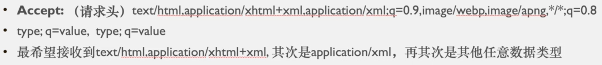
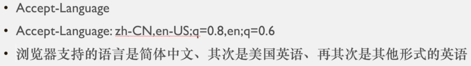
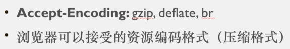
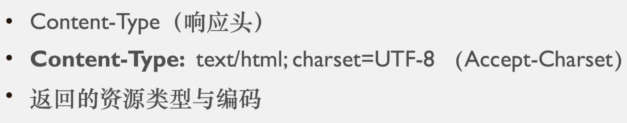
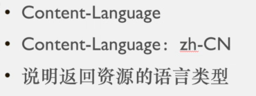
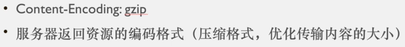

# 状态码

| **1XX** |  信息，服务器收到请求，需要请求者继续执行操作  |
| :-----: | :--------------------------------------------: |
| **2XX** |           成功，操作被成功接收并处理           |
| **3XX** |       重定向，需要进一步的操作以完成请求       |
| **4XX** |  客户端错误，请求包含语法错误或者无法完成请求  |
| **5XX** | 服务器错误，服务器在处理请求的过程中发生了错误 |

## 304 重定向

当客户端请求资源时，如果资源未被修改，服务器会返回`304 Not Modified`状态码，指示客户端使用缓存中的资源。

1. 客户端点击链接`A`跳转到`B`，但`B`又跳转到`C`，这种连续跳转称为重定向。
2. 服务器会检查缓存中是否存在请求的资源，如果存在，则重定向客户端从缓存中获取资源。

**ETag**：服务器为每个资源分配的唯一标识符，用于验证资源是否被修改。

**Last-Modified**：资源最后一次修改的时间，精确到秒，采用格林威治标准时间（GMT）。

### 304 详解

#### 第一次请求

服务器向客户端发送响应头，包含`ETag`和`Last-Modified`，告知客户端该资源的唯一标识和最后修改时间。

#### 第二次请求

客户端在后续请求中，会在请求头中添加`If-Modified-Since`和`If-None-Match`，分别携带`Last-Modified`和`ETag`的值。服务器接收到请求后，会比较这两个值：

- 如果`If-Modified-Since`和`If-None-Match`与服务器上的资源一致，说明资源未被修改，服务器返回`304 Not Modified`，客户端使用缓存中的资源。
- 如果不一致，服务器返回新的资源内容，并更新`ETag`和`Last-Modified`。

## 302 重定向

`302 Found`状态码表示请求的资源暂时被移动到另一个 URL，客户端需要使用新的 URL 继续访问。这通常用于临时性重定向，如页面维护或临时更换资源位置。

## 404 Not Found

`404 Not Found`状态码表示服务器无法找到请求的资源或页面。这通常是由于 URL 错误、资源被删除或移动导致的。

## 403 Forbidden

`403 Forbidden`状态码表示服务器理解请求但拒绝执行。这通常是因为客户端没有访问资源的权限，或者服务器配置限制了访问。

## 500 Internal Server Error

`500 Internal Server Error`状态码表示服务器在处理请求时发生了内部错误。这通常是由于服务器端代码错误、配置问题或资源不可用导致的。

## 503 Service Unavailable

`503 Service Unavailable`状态码表示服务器暂时无法处理请求，可能是由于过载或维护。客户端可以稍后重试请求。常见原因包括：

- 服务器负载过高，导致队列溢出。
- 应用程序池被关闭或服务正在维护中。

# ACCEPT（请求头）

`Accept`请求头表示客户端希望接收的数据类型或格式。

## q：相对品质因子

**品质因子**，范围`0~1`，用于指定不同内容类型的优先级。默认质量值为`q=1`。

- 设置`q=0`表示客户端不接受该内容类型。
- 例如，`q=0.9`表示浏览器更希望接收`xml`格式，`q=0.8`则次之，表示对`png`格式的接受度较低。

## Accept-Language

`Accept-Language`请求头指定客户端希望接收的自然语言。客户端根据此头部选择最合适的语言版本进行响应。

## Accept-Encoding

`Accept-Encoding`请求头指定客户端希望接收的内容编码。服务器根据此头部选择合适的编码方式进行响应，如`gzip`、`deflate`等。

# CONTENT-TYPE（响应头）

`Content-Type`响应头指示返回资源的类型和编码方式，帮助客户端正确解析和显示资源内容。

## Content-Language

`Content-Language`响应头指示返回内容的自然语言，帮助客户端选择合适的语言进行显示。

## Content-Encoding

`Content-Encoding`响应头指示返回内容使用的编码方式，如`gzip`、`deflate`等，帮助客户端正确解码和显示内容。

# ACCEPT（请求头）

`Accept`请求头表示客户端希望接收的数据类型或格式。

## q：相对品质因子

**品质因子**，范围`0~1`，用于指定不同内容类型的优先级。默认质量值为`q=1`。

- 设置`q=0`表示客户端不接受该内容类型。
- 例如，`q=0.9`表示浏览器更希望接收`xml`格式，`q=0.8`则次之，表示对`png`格式的接受度较低。

## Accept-Language

`Accept-Language`请求头指定客户端希望接收的自然语言。客户端根据此头部选择最合适的语言版本进行响应。

## Accept-Encoding

`Accept-Encoding`请求头指定客户端希望接收的内容编码。服务器根据此头部选择合适的编码方式进行响应，如`gzip`、`deflate`等。

# CONTENT-TYPE（响应头）

`Content-Type`响应头指示返回资源的类型和编码方式，帮助客户端正确解析和显示资源内容。

## Content-Language

`Content-Language`响应头指示返回内容的自然语言，帮助客户端选择合适的语言进行显示。

## Content-Encoding

`Content-Encoding`响应头指示返回内容使用的编码方式，如`gzip`、`deflate`等，帮助客户端正确解码和显示内容。

