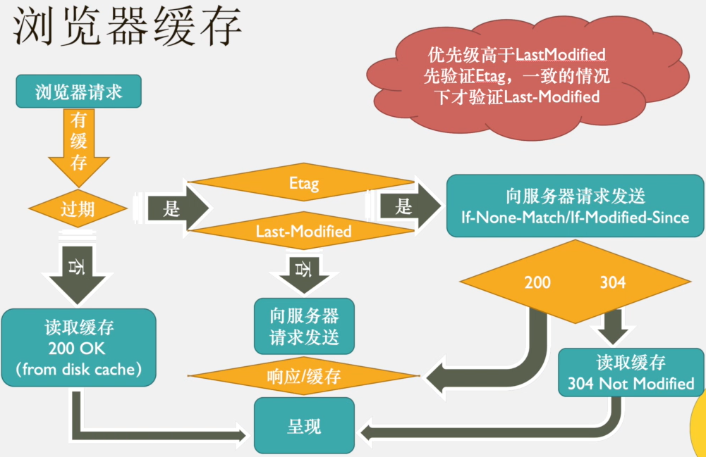
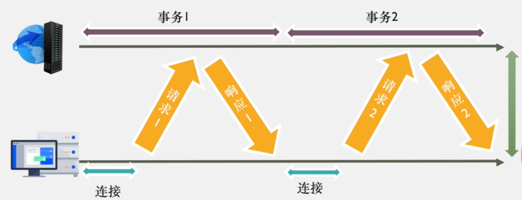
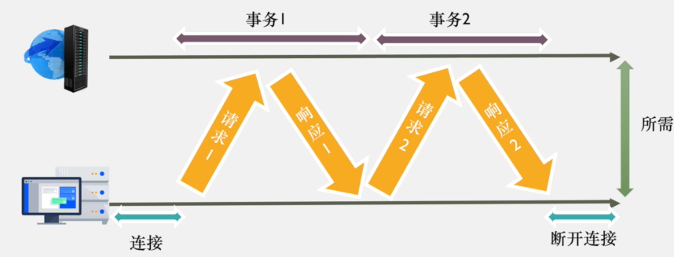
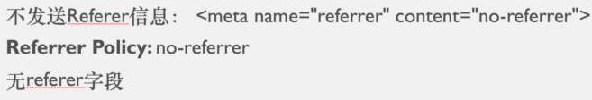
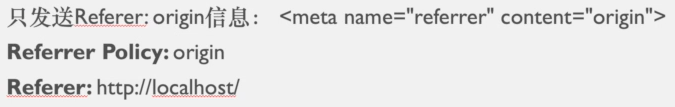
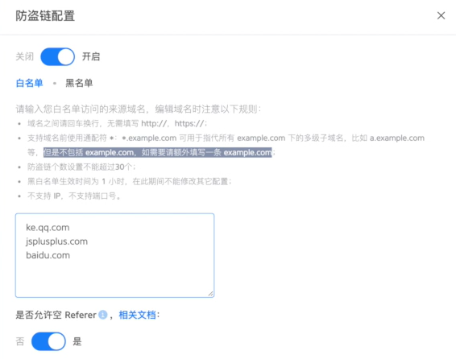

# 浏览器缓存

将已请求并返回的 WEB 资源（HTML、CSS、JS、数据等）复制为一个副本并存储在浏览器的缓存中。

## 缓存的好处

减少网络带宽消耗  
降低服务器压力  
缩短网络延迟

# Pragma

```http
Pragma:no-cache
```

此响应头指示浏览器忽略资源缓存副本，每次访问时都需从服务器获取资源。`Pragma`是`HTTP/1.0`中的字段，`HTTP/1.1`中使用`Cache-Control`代替。由于 HTTP 协议向下兼容，许多网站仍保留此字段。

# Cache-Control

`Cache-Control`用于缓存控制的响应头，包含以下指令：

```http
Cache-Control: no-cache
```

指示浏览器忽略资源缓存副本，强制从服务器获取资源，但浏览器仍会缓存。

```http
Cache-Control: no-store
```

强制在任何情况下都不保留缓存副本。

```http
Cache-Control: max-age=3153600
```

指定缓存副本的有效时长，从请求时间开始到过期时间之间的秒数。

```http
Cache-Control: public
```

表明响应可以被任何对象缓存，包括发送请求的客户端和代理服务器。

```http
Cache-Control: private
```

不共享缓存，仅允许单个用户缓存，代理服务器无法缓存。

# Expires

`Expires`用于启用缓存和定义缓存时间。它告知浏览器缓存资源及其过期时间，如果缓存未过期则不发起请求。在`HTTP/1.1`中，推荐使用`Cache-Control: max-age=秒`来替代。


# 浏览器缓存图解



# KEEP-ALIVE

## 短连接

每请求一个资源就建立一次连接，请求完成后断开连接。  
建立 TCP 连接、请求资源、响应资源、断开连接。  
早期的`HTTP/1.0`中，每个 HTTP 请求都需要创建一个 TCP/IP 连接。  
采用串行连接方式，属于短连接。



## 长连接

仅建立一次连接，多次资源请求复用该连接，完成后关闭。



## 后期的 HTTP/1.0

在请求头中增加：

```http
Connection: keep-alive
```

## HTTP/1.1

默认启用：

```http
Connection: keep-alive
```

如需关闭，使用：

```http
Connection: close
```

## 注意

`Connection: keep-alive`在大多数浏览器中默认使用`HTTP/1.1`，服务器也需要相应支持才能实现 C/S 协议中的长连接。

# CONTENT-LENGTH

`Content-Length`用于描述 HTTP 消息实体的传输长度。

## GET 请求

请求头中不包含`Content-Length`，响应头中包含。

## POST 请求

请求头和响应头中均包含`Content-Length`。

# REFERER

`Referer`指来源域名。

当前进入的网页来自于哪里，可以记录源网站。通过`Referer`可以分析不同渠道的流量分布和用户搜索的关键词。

## 不发送 Referer 信息



## 只发送源头



## HTTPS 跳转到 HTTP 页面或资源


## 防止资源盗链

服务器在拉取资源前判断`Referer`是否为自己的域名或 IP，如果不是则拦截；如果是，则允许拉取。

防盗链有时会导致网站访问资源出现问题。


