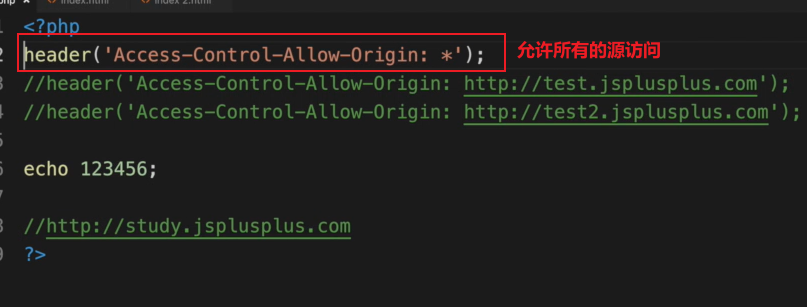
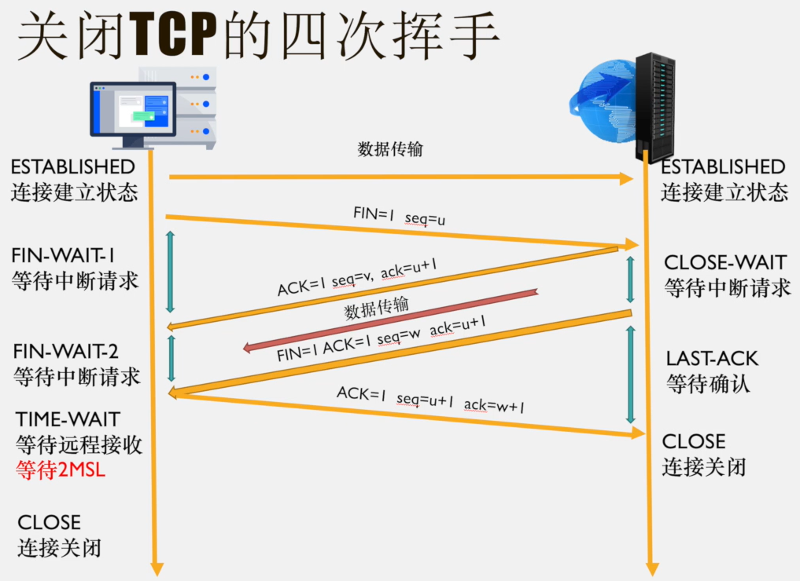

# HTTP 协议版本

## HTTP/1.1

HTTP/1.1 引入了多项改进以增强性能和功能：

增加持久连接默认开启 `Connection: keep-alive`。这允许在单一的 TCP 连接上发送多个请求，减少连接建立的开销。

支持管道机制，允许多个请求同时发送而无需等待前一个请求的响应，从而提高传输效率。

新增 `PUT`、`PATCH`、`OPTIONS`、`DELETE` 等请求方法，提供更丰富的操作手段。

引入 `Host` 字段，用于指定服务器域名，使得同一 IP 地址可以托管多个域名。

增加 `100 Continue` 状态码，允许客户端只发送请求头，服务器在准备好后再接收请求体，优化数据传输。

引入身份验证机制，增强安全性，支持基本认证和摘要认证等方式。

支持部分内容传输和文件断点续传，提升大文件传输的可靠性和效率。

增加了 24 个错误状态码，提供更详细的错误信息以便于调试和处理。

## HTTP/0.9-Beta

HTTP/0.9-Beta 是最早期的 HTTP 版本，功能较为有限：

仅支持 `GET` 请求方法，无法处理其他类型的请求。

只能请求和访问 HTML 格式的资源，缺乏对其他数据格式的支持。

## HTTP/1.0

HTTP/1.0 在 HTTP/0.9 的基础上进行了多项扩展：

新增 `POST` 和 `HEAD` 请求方法，允许客户端提交数据并请求资源的头部信息。

支持多种数据格式的请求与访问，增强了协议的灵活性。

引入缓存功能，允许服务器和客户端缓存响应，减少不必要的数据传输，提高访问速度。

新增状态码、支持多字符集和内容编码，提升了协议的表达能力和国际化支持。

### 早期与后期的连接管理

早期的 HTTP/1.0 不支持 `keep-alive` 长连接，只能进行串行连接。后期通过增加 `Connection: keep-alive` 字段（非标准字段）开始支持长连接，提高了连接的复用性和效率。

## HTTP/2.0

HTTP/2.0 带来了显著的性能提升和新的功能特性：

引入双工模式，允许客户端同时发送多个请求，服务器并行处理多个响应，提高了传输效率。

支持服务器推送，服务器可以主动向客户端推送所需资源，特别适合加载静态资源，减少延迟。

实现头信息压缩机制，通过二进制压缩头部信息，减少数据量，加快传输速度。由于 HTTP 协议不保留状态，每次请求都会携带所有头信息。

采用二进制协议，头信息与数据体均使用二进制传输，提高了解析效率和可靠性。

支持多工处理，允许先发送已处理好的部分，再响应其他请求，最后处理未完成的部分，优化了资源利用和响应时间。

# TCP 连接关闭的四次挥手

TCP 连接的关闭过程涉及四次挥手，确保双方都能正确终止连接。

## 第一次挥手

客户端发送连接关闭报文，表示已停止发送数据。

报文首部设置 `FIN=1`，序列号为 `seq=u`。

此时客户端进入终止等待 I（`FIN-WAIT-1`）状态。

## 第二次挥手

服务器收到关闭报文后，发送确认报文。

报文首部设置 `ACK=1` 和 `ack=u+1`，确认收到 `FIN`，序列号为 `seq=v`。

服务器进入关闭等待（`CLOSE-WAIT`）状态。

此时连接处于半关闭状态，客户端不再发送数据，但服务器仍可发送数据。

### 数据传输

客户端收到服务器的确认后，进入终止等待 II（`FIN-WAIT-2`）状态。服务器在此期间需确认所有数据已发送完毕，若未完成，将继续发送数据。

## 第三次挥手

服务器确认数据已发送完毕后，向客户端发送关闭报文，进入最后确认（`LAST-ACK`）状态。

报文首部设置 `FIN=1`、`ACK=1` 和 `ack=u+1`，序列号为 `seq=w`。

## 第四次挥手

客户端收到服务器的关闭报文后，发送接收确认报文，进入时间等待（`TIME-WAIT`）状态。

报文首部设置 `ACK=1` 和 `ack=w+1`，序列号为 `seq=u+1`。

## 结束

服务器收到客户端的确认后，立即进入 `TCP` 关闭状态，连接结束。通常服务器比客户端更快完成关闭过程。

### 状态解释

`TIME-WAIT` 持续时间为 `2MSL`（Maximum Segment Lifetime），确保所有报文均已正确传输。

`MSL` 的值根据不同情况有所不同，通常为 30 秒、1 分钟或 2 分钟。

#### 目的

确保最后一个报文能够被服务器接收，防止报文丢失导致连接状态不同步。如果 `FIN+ACK` 报文丢失，服务器将在 `TIME-WAIT` 时间内重新发送，客户端可重新进行第四次挥手并重启计时器。

# 为什么是四次挥手

首次挥手时，客户端发送 `FIN` 包，服务器接收后表示客户端不再发送数据，但仍可接收数据。服务器发送确认包并确认是否有剩余数据需要发送，此阶段为 `CLOSE-WAIT`。因此，从终止等待 I 到结束需要四次挥手，每次挥手涉及发送和确认报文，确保双方都能正确关闭连接。

# TCP 连接建立后，客户端突然出现故障

## TCP 保活计时器

当客户端故障时，服务器通过保活计时器检测连接状态。每次收到客户端请求后，服务器复位保活计时器，通常设置为 2 小时。如果在 2 小时内未收到客户端数据，服务器将发送探测报文段，每隔 75 分钟发送一次。若连续发送 10 次探测报文仍无响应，服务器将断开连接，认为客户端已故障。

# 同源策略

同源策略（Same-Origin Policy，SOP）是浏览器的一项安全机制，仅允许源相同的页面脚本相互访问数据。

## 解释

1. **被跨域资源共享策略阻止**

   当请求跨域资源时，如果服务器未设置允许跨域的响应头，浏览器会阻止访问，并提示 `has been blocked by CORS policy`。

2. **未包含 `Access-Control-Allow-Origin` 头**

   请求的资源未设置 `Access-Control-Allow-Origin` 头，导致浏览器拒绝访问。

## 源的定义

源由协议（HTTP/HTTPS）、域名（一级或二级）和端口（如 8080）组成。

### 同源

具有相同的协议、域名和端口。

### 不同源（跨域）

协议、域名或端口任一不同。

## 配置不同源可访问

## 安全性

同源策略是浏览器的重要安全功能，防止不同源的脚本在未授权的情况下读写对方资源。只有同源脚本拥有对 `DOM`、`Cookie`、`Session` 和 `AJAX` 等操作的权限。

## 不受同源策略限制的项

页面的超链接、重定向、表单提交以及资源引入（如 `script`、`src`、`link`、`href`、`img`、`iframe src`）不受同源策略限制。

**所有使用 JavaScript 引擎的浏览器均实施同源策略。**

# 关闭 TCP 连接的前奏

关闭 TCP 连接涉及多个状态转换：

- `FIN: finish` 用于关闭连接。
- `FIN-WAIT-1`: 发送关闭请求，等待确认。
- `FIN-WAIT-2`: 等待远程 TCP 断开连接请求。
- `CLOSE-WAIT`: 服务器等待客户端确认。
- `LAST-ACK`: 等待原关闭请求的确认。
- `TIME-WAIT`: 确保远程 TCP 收到断开请求的确认。
- `CLOSED`: 无任何连接状态。

